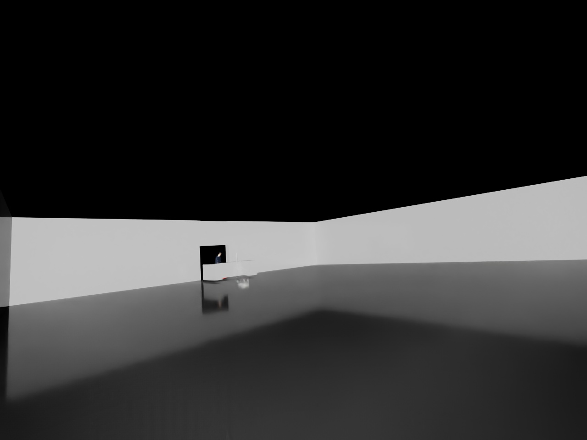
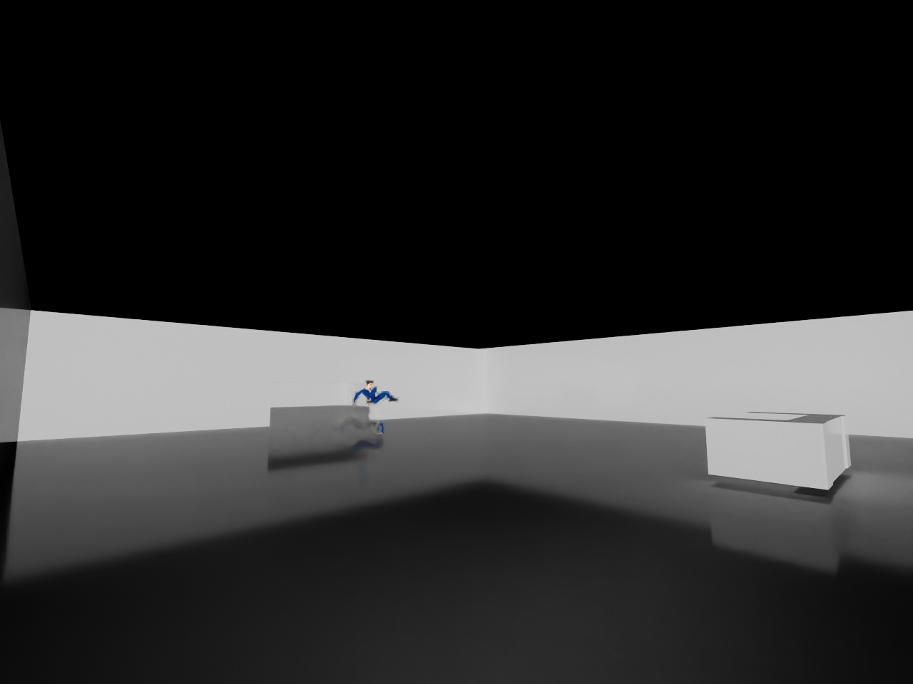
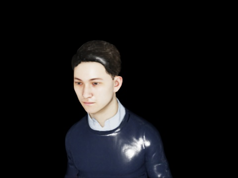

# Isaac Sim Multi-Camera Surveillance & Response System

A simulated surveillance pipeline built in NVIDIA Isaac Sim: four fixed zone
cameras watch a two-room building for falls and loitering, a robot checks
everyone in at the door, and re-identification (face + clothing) tracks who's
who as they move, overstay, get helped up, or get turned away.



Developed iteratively over several months as a portfolio project for
robotics/AI internship applications, with every fix and the bug that
prompted it documented as comments at the point in the code where it
happened.

## What it does

A reception desk, two rooms and a doorway, watched by four fixed cameras and
one mobile robot (a Nova Carter–styled kinematic robot). Simulated people
walk in, are checked at the door, wander, idle, fall over and overstay — and
the robot deals with all of it on its own:

1. **Door check-in** — the robot sits inside the reception counter and scans
   everyone who comes through the front door once (clothing match first,
   then DeepFace face ID). Known-banned IDs are turned away at the door;
   unknown intruders are auto-banned on the spot and turned away too, with a
   visible reaction beat first — the person plays an "angry" animation, then
   turns and leaves using a distinct "sad walk," so a denial actually reads
   as one on screen instead of an instant teleport. A flagged person is
   marked with a red ring on the floor at their feet, not a recolor of the
   person themselves.
2. **Zone monitoring** — four fixed cameras cover the two rooms. Each
   compares its view to a clean empty-room reference (background subtraction
   with illumination compensation, color and fill filters) and flags
   **falls** (person-shaped blob with a fall silhouette, or motionless for
   several sweeps regardless of viewing angle) and **loitering** (presence
   over consecutive sweeps). Two cameras per room are de-duplicated so one
   fall means one dispatch, and dispatches carry a real unique ID so two
   alerts logged in the same instant can never make the robot silently skip
   one of them.
3. **Fall response** — the robot drives to the fallen person, helps them up
   (get-up animation), then identifies them for an injury log entry.
4. **Loitering response** — the robot tracks the specific person by identity
   (not a one-time coordinate snapshot) the whole way there and re-aims at
   every orbit standpoint, so a search still finds them even if they keep
   wandering during the chase. Each identified loiterer is tracked by ID
   across incidents; a single incident gets a warning and an escort, and the
   ID gets banned only after repeated loitering. (An instant one-strike ban
   was tried and dropped — ordinary ambient wandering trips the loitering
   threshold often enough that it emptied the building within two minutes.)
5. **Time limit** — the robot remembers when each ID first arrived; anyone
   over the visit limit (60 s in this demo) is found and escorted out — never
   while they're still down and waiting to be helped up.
6. **Continuous cycle** — escorted-out residents come back through the door
   as fresh visits and intruders retry later, so a long run never ends up as
   an empty building. Ban/identity state resets fresh at the start of every
   run, so a long test session can't permanently run out of people. Characters
   also pause for idle animations (salute, excited, phone call, standing
   idle) between wandering.




## Architecture

The system is organized into four layers:

- **Sensing** — Isaac Sim cameras (4 fixed zone cameras + 1 robot-mounted
  camera), `isaacsim.sensors.camera.Camera`
- **Processing** — OpenCV background subtraction for the zone cameras, YOLOv8
  for person detection on the robot and door cameras, DeepFace (face
  embedding + re-ID) plus clothing-histogram matching; the models run as
  persistent worker subprocesses so they load once instead of per-frame
- **Decision** — rule-based anomaly logic (fall, loitering, banned or
  unauthorized entry, overstay) plus a dispatch/orbit-search controller for
  the robot, with every dispatch carrying a real unique ID so it can be
  tracked and resolved reliably even when several fire at once
- **Output** — event log (`event_log.json`) and a live FastAPI + SQLite
  dashboard (`reporting/dashboard.py`)

## Tech stack

Python · NVIDIA Isaac Sim 6.0 · YOLOv8 · DeepFace · OpenCV · FastAPI · SQLite

## Running it

```
run_simulation.bat
```

launches the simulation (double-click it, or run it from anywhere). It holds
for 30 s on startup while the scene and detection models load — nothing moves
and no timers run until then — then the sim runs live in its own window.

```
run_dashboard.bat
```

opens the live dashboard at <http://127.0.0.1:8000/> (run it alongside the
sim, or after — it just reads `event_log.json`).

Set `SIM_RECORDING_MODE=1` before launching if you're screen-recording a run:
it skips writing the per-sweep diagnostic images to `debug_captures/`, which
is what was actually competing with a screen recorder's own disk writes for
I/O and causing visible stutter — not the detection pipeline itself.

Python dependencies beyond Isaac Sim's own bundled interpreter are listed in
`requirements.txt` (install with `C:\isaacsim\python.bat -m pip install -r
requirements.txt` — see that file's own header for why it's Isaac Sim's
interpreter and not a separate venv).

## Media

- `media/screenshots/` — real captures pulled from the simulation's own debug
  pipeline (not staged), included above. To add more, run the sim, then look
  in `debug_captures/` (regenerated every run — not committed, see
  `.gitignore`) for `*_RAWFRAME.jpg` (zone camera views) and `*_crop.jpg`
  (the robot's own close-up face scans), and copy the ones you want into
  `media/screenshots/`.
- `media/videos/` — put a screen recording here (e.g. `demo.mp4`) and link it
  from this section once you have one. Record with `SIM_RECORDING_MODE=1`
  set (see **Running it** above) so the disk I/O from diagnostic captures
  doesn't fight your recorder for bandwidth.
- A dashboard screenshot: run `run_dashboard.bat`, open
  <http://127.0.0.1:8000/>, screenshot it, and drop it in
  `media/screenshots/` too — I can't capture a live browser page myself, only
  the simulation's own camera frames.

## Repo layout

```
unified_tracking.py    Main simulation script (everything runs from the repo root)
run_simulation.bat      Entry point for the sim
run_dashboard.bat       Entry point for the live dashboard
requirements.txt, LICENSE, .gitignore

config/
  camera_zones.json     Zone camera configuration

workers/
  yolo_worker.py         Persistent YOLO subprocess worker (person detection)
  deepface_worker.py     Persistent DeepFace subprocess worker (face embedding + re-ID)

reporting/
  dashboard.py           FastAPI + SQLite live dashboard reading the event log
  report_lib.py          Event-log analysis the dashboard is built on
  analyze_run.py         Cross-checks a run against Kit's own engine log, independent of the event log

pipeline/                One-time animation setup - convert an FBX to USD, then bind it onto each character
  bind_fall_animation.py, bind_get_up_animation.py, bind_idle_animations.py, bind_denial_reaction_clips.py
  convert_fall_clip.py, convert_get_up_clip.py, convert_idle_clips.py, convert_angry_clip.py, convert_sad_walk.py
  strip_root_motion.py           removes a walk clip's baked-in forward travel
  fix_idle_translations.py       repair for an earlier bind_idle_animations.py bug (already applied)
  fix_fall_translation_and_hold.py

tools/
  flag_id_as_banned.py   Manually flag a recognized ID as banned, outside the automatic intruder flow

assets/                  Character rigs + animation clip sources the sim actually loads (raw FBX/textures excluded, see below)
media/                   Screenshots and video - see Media
dev_archive/             Superseded scripts from earlier development, not shipped - see dev_archive/README.md

known_faces/, run_state_backups/, debug_captures/, run_logs/
                        Runtime output, regenerated every run, not committed (see .gitignore)
```

Large binary scene assets (raw `.fbx` character exports, textures) are
excluded via `.gitignore` to keep the repo focused on the actual system code
and within reasonable size — the conversion/binding scripts above are what
turn them into what the sim uses, for anyone who has the source Mixamo
assets to reproduce it.

## Known limitations

- A motionless-person fall takes longer to detect than a side-on one (it
  needs several sweeps of evidence that nothing is moving)
- Loitering alerts fire often when two people are always on site, so the
  robot spends a good share of its time on identification scans
- Falls happen with 70% probability per person per run by default; set
  `SIM_FORCE_FALLS=1` to guarantee both for a demo or test run
- A rare, walking pose that briefly holds a stable, wide silhouette can
  register as a false fall alarm

## Features

- Door check-in, denial (with a visible reaction) and auto-ban for
  independent intruders
- Fall detection from any angle, assist, and injury log
- Loitering detection with continuous identity tracking through the search,
  escalating to a ban after repeated incidents
- Overstay tracking and escort, with returning visitors
- Idle and "denied" reaction animations
- FastAPI + SQLite backend with live dashboard
